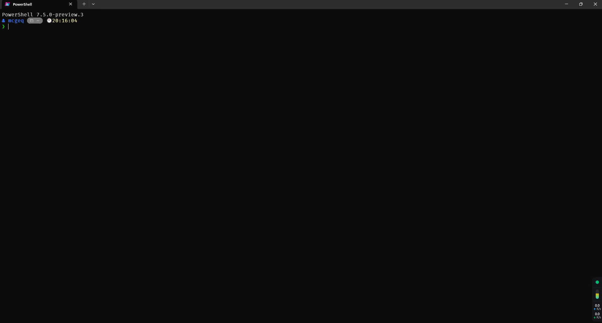

# About



这是**powershell**配置

## Alias

```
gad  git add .
gst  git status
gph  git push
gpl  git pull
gcz  pnpm run commit
gcn  git checkout -b
gch  git checkout
gbr  git branch
gme  git merge --no-ff
gab  git fetch --all
gsu  git submodule update --init --recursive
gpha  git push --all origin -u
```

## 配置

- powershell 使用starship配置，详细配置见 [starShip](../mcge-starship/README.md)
- powershell版本-PowerShell 7.5.0-preview.3 [Download](https://github.com/PowerShell/PowerShell/releases)
- 启用fnm环境
- 历史命令

## 终端

windows terminal