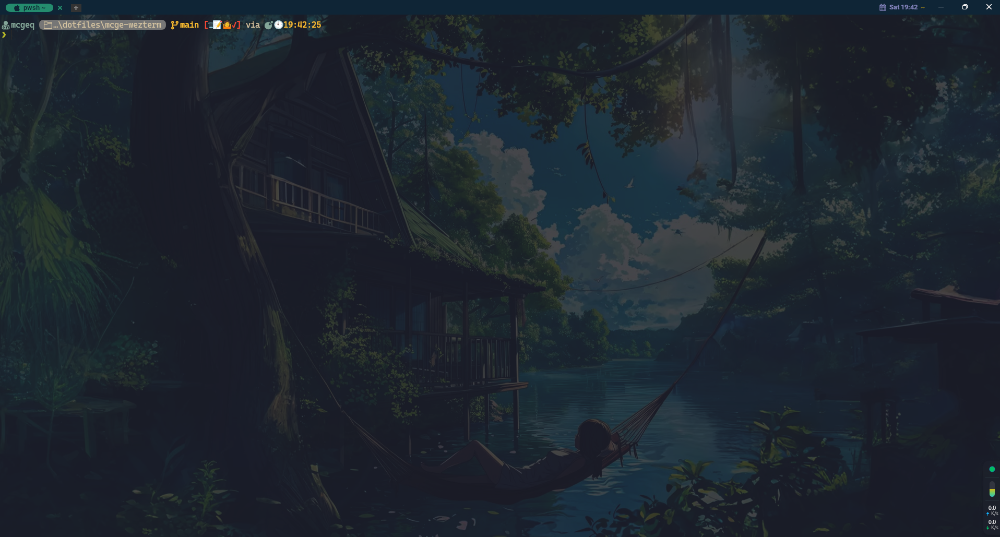

# About



这里是**Wezterm**的详细配置。

## 使用方法

### 第一种

- 复制**mcge-wezterm**目录下的文件
- windows平台，文件复制到%USERPROFILE%\.config\wezterm目录下
- Linux平台，文件复制到$HOME/.config/wezterm目录下

### 第二种

创建wezterm目录链接

- windows平台执行dotfiles目录下的**install.bat**
- ~~linux平台执行dotfiles目录下的**install.sh**~~

## 目录结构

```
MCGE-WEZTERM
├─backdrops
├─colors
├─config
├─events
├─screenshots
└─utils
```
### 目录详解

- backdrops 背景图片
- colors 自定义主题颜色
- config 详细配置
- event 事件
- screenshots 配置截图
- utils 公共方法等

## cmd

使用的shell

- cmd
- pwsh
- powershell
- Git Bash
- Nushell

## WSL

配置的WSL是**Arch**，请自行更改

## 字体

使用字体: =Cascadia Mono=

若要想更换字体请在**config/fonts.lua**文件中更换

## 快捷键

```
#快捷键
Ctrl+shift+c    --复制
Ctrl+shift+v    --粘贴
Ctrl+shift+r    --重命名标签栏
Ctrl+alt+[\]    --水平拆分窗格，即左右拆分
Ctrl+alt+[/]    --垂直拆分窗格，即上下拆分
Ctrl+alt+[-]    --关闭当前窗格
Ctrl+alt+z      --最大化/最小化当前窗格
F11             --全屏
Ctrl+alt+[↑]    --向上扩展窗格
Ctrl+alt+[↓]    --向下扩展窗格
Ctrl+alt+[←]    --向左扩展窗格
Ctrl+alt+[→]    --向右扩展窗格
Alt+[↑]         --放大字体
Alt+[↓]         --缩小字体
Alt+r           --重置字体大小
```

