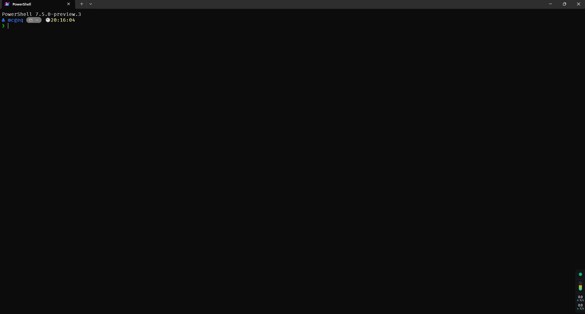

[中文](README.zh.md)

# PowerShell Configuration — Modular Edition

[](https://github.com/PowerShell/PowerShell)
[](LICENSE)

> Highly modular, easy-to-maintain and extend PowerShell profile.



---

## Features

- 🧩 **Modular architecture** — Functions organized by module
- 📦 **Auto-loading** — Modules load on demand for performance
- 🎨 **Starship prompt** — Beautiful and highly customizable
- 🔧 **Rich toolset** — Git, Jujutsu, system admin, network tools
- ⚡ **Smart completion** — PSReadLine predictive history
- 🌐 **Multi package manager** — pip, Chocolatey, Scoop, Winget

---

## Directory Structure

```
powershell/
├── Microsoft.PowerShell_profile.ps1       # Main entry point
├── modules/                                # Feature modules
│   ├── git.psm1                           # Git operations
│   ├── jujutsu.psm1                       # Jujutsu operations
│   ├── utilities.psm1                     # Utility functions
│   ├── system.psm1                        # System administration
│   └── network.psm1                       # Network management
├── config/                                 # Configuration files
│   └── settings.psd1                      # Global settings
└── README.md                               # Docs
```

---

## Quick Start

### 1. Install Dependencies

```powershell
# Required modules
Install-Module PSReadLine -Force
Install-Module Terminal-Icons -Force

# Optional tools
winget install starship         # Prompt
winget install ajeetdsouza.fnm  # Node.js version manager
scoop install scoop-search      # Scoop search enhancement
```

### 2. Load Profile

```powershell
. $PROFILE
# Or restart PowerShell
```

---

## Module Reference

### Git (`git.psm1`)

| Function | Alias | Description |
|----------|-------|-------------|
| `Invoke-GitAdd` | `gad` | Stage all changes |
| `Invoke-GitStatus` | `gst` | View status |
| `Invoke-GitPush` | `gph` | Push to remote |
| `Invoke-GitPull` | `gpl` | Pull from remote |
| `Invoke-GitCommit` | `gco` | Commit changes |
| `New-GitBranch` | `gcn` | Create new branch |
| `Switch-GitBranch` | `gch` | Switch branch |
| `Get-GitBranches` | `gbr` | List branches |
| `Merge-GitBranch` | `gme` | Merge branch |
| `Sync-GitSubmodules` | `gsync` | Sync all submodules |
| `Invoke-ConventionalCommit` | `gcz` | Commitizen commit |

**Submodule management:**
- `gsi` — Initialize submodules
- `gspl` — Update submodules
- `gsync` — One-command sync all submodules

### Jujutsu (`jujutsu.psm1`)

| Function | Alias | Description |
|----------|-------|-------------|
| `Invoke-JujutsuAdd` | `jad` | Add files |
| `Get-JujutsuStatus` | `jst` | View status |
| `Invoke-JujutsuCommit` | `jco` | Commit changes |
| `Get-JujutsuLog` | `jlg` | View log |
| `Invoke-JujutsuGitPush` | `jjp` | Push to Git |
| `Sync-JujutsuMain` | `jfm` | Sync to main |

### Utilities (`utilities.psm1`)

| Function | Alias | Description |
|----------|-------|-------------|
| `New-Directory` | `mk` | Create directory |
| `New-File` | `touch` | Create/update file |
| `Remove-ItemSafe` | `rm` | Safe delete |
| `Open-ExplorerHere` | `open` | Open File Explorer |
| `Get-DirectoryList` | `ls` | List directory |
| `Invoke-PdmPython` | `pru` | PDM Python runner |
| `Invoke-UvPython` | `uvr` | UV Python runner |

### System (`system.psm1`)

| Function | Alias | Description |
|----------|-------|-------------|
| `Update-AllPackages` | `os-update` | Update all package managers |
| `Get-SystemInfo` | `sysinfo` | System information |

### Network (`network.psm1`)

| Function | Alias | Description |
|----------|-------|-------------|
| `Set-SystemProxy` | — | Set proxy |
| `Remove-SystemProxy` | — | Remove proxy |
| `Get-NetworkAdapters` | `getnic` | Network adapters |
| `Get-ActiveIPv4Routes` | `getip` | IPv4 routes |
| `Get-ActiveIPv6Routes` | `getip6` | IPv6 routes |
| `Get-PublicIP` | `myip` | Public IP |

---

## Configuration

Edit `config/settings.psd1` to customize:

```powershell
@{
    # Proxy settings
    Proxy = @{
        Url = "http://localhost:7897"
        Enabled = $false
    }

    # Git config
    Git = @{
        DefaultBranch = "main"
        SubmoduleBranches = @("main", "master", "trunk")
    }

    # Module toggles
    Modules = @{
        PSReadLine = $true
        TerminalIcons = $true
        Starship = $true
        ScoopSearch = $true
        Fnm = $true
    }
}
```

---

## Usage Examples

### Git workflow

```powershell
gad                   # Stage all changes
gco "feat: new feature"  # Commit
gph                   # Push

gcn feature/new-ui    # Create new branch
gch main              # Switch to main
gme feature/new-ui    # Merge branch

gsync                 # Sync all submodules
```

### Jujutsu workflow

```powershell
jad                   # Add changes
jco "feat: new feature"  # Commit
jfm                   # Sync to main
jjp                   # Push to Git
```

### System management

```powershell
os-update             # Update all package managers
sysinfo               # System information
myip                  # Show public IP
```

---

## Custom Extensions

### Add a new module

1. Create a module file in `modules/`:

```powershell
# modules/custom.psm1
function Get-CustomInfo {
    Write-Host "Custom module loaded!" -ForegroundColor Green
}

Export-ModuleMember -Function 'Get-CustomInfo'
```

2. Import it in the main profile:

```powershell
Import-Module (Join-Path $ModulesDir "custom.psm1")
```

### Add an alias

```powershell
Set-Alias -Name myalias -Value Get-CustomInfo
```

---

## Dependencies

### Required

- PowerShell 7.5+
- PSReadLine
- Terminal-Icons

### Optional

- Starship (prompt)
- fnm (Node.js version manager)
- scoop-search (Scoop enhancement)
- Git / Jujutsu

---

## Changelog

### 2025-11-30
- Modular refactor
- Split into 5 modules (Git, Jujutsu, Utilities, System, Network)
- External config file support
- Unified Verb-Noun naming convention
- Enhanced error handling

---

## License

MIT License

---

## Author

**mcge** <<mcgeq@outlook.com>>

---

## Acknowledgments

- [PowerShell](https://github.com/PowerShell/PowerShell)
- [Starship](https://starship.rs/)
- [PSReadLine](https://github.com/PowerShell/PSReadLine)
- [Terminal-Icons](https://github.com/devblackops/Terminal-Icons)
